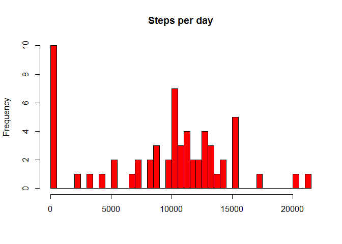

# Reproducible Research: Peer Assessment 1


## Loading and preprocessing the data

To load and process the data for evaluation, the data was read in using read.csv, and NA values assigned to be actual NA values in R.


```
## Warning in rm(ACT): object 'ACT' not found
```

```
## 
## Attaching package: 'dplyr'
```

```
## The following objects are masked from 'package:stats':
## 
##     filter, lag
```

```
## The following objects are masked from 'package:base':
## 
##     intersect, setdiff, setequal, union
```


```r
## This script reads in the data.  

ACT <- read.csv("activity.csv", na.strings = "NA")
```

## What is mean total number of steps taken per day?

The mean total number of steps taken by day is 9354 and the median is 10395.  This was found by grouping the data together by date and summarizing based on those groupings.


```r
## This script groups and summarizes the steps by day

bydayACT <- summarise(group_by(ACT, date), "total" = sum(steps, na.rm = TRUE))
meanACT <- mean(bydayACT$total,na.rm=TRUE)

medianACT <- median(bydayACT$total, na.rm = TRUE)
```

However, a high number of users logged no steps at all which pulls the averages down.  See chart below for complete histogram of totals.

\


## What is the average daily activity pattern?

Here, the data was grouped by interval rather than by date, to better show the pattern of activity on average across a day.  

The following code was used to group the data.


```r
intmeanACT <- summarise(group_by(ACT, interval), "mean" = mean(steps, na.rm = TRUE))
```

The daily interval that, on average, contained the most amount of steps was 835, corresponding to roughly 8:30 in the morning.


```r
## This code finds the average maximum interval

maxintervalnumber <- max(intmeanACT$mean)
maxinterval <- subset(intmeanACT, intmeanACT$mean == maxintervalnumber, select = 1)
```

The chart below shows clear activity during the middle of the day, and less from midnight to 5 am when users would likely have been asleep.

\


## Imputing missing values

There were many missing values in the data, 2304, which equates to 8 days, that may be influencing the results.  


```r
## This code counts the number of NAs in the datatable

naACT <- sum(is.na(ACT))
```

To see what the data might have looked like, the nearest interval mean has been inserted into the missing values.


```r
## This code looks through the database and replaces NA in the steps column with the 
## corresponding interval mean, creating a new datatable called tidyACT

tidyACT <- ACT
    
    for (x in seq_along(tidyACT$steps)){
    intervalnumber <- intmeanACT$interval
    intervalmean <- intmeanACT$mean
    if (is.na(ACT$steps[x]) == TRUE){
        interval <- ACT$interval[x]
        intervalmean <- intmeanACT[intmeanACT$interval==interval,2]
        intervalmean <- as.numeric(intervalmean)
        tidyACT$steps[x] <- round(intervalmean,0)
  }

}  

## This code groups and summarizes the tidyACT data by day

bydaytidyACT <- summarise(group_by(tidyACT, date), "total" = sum(steps, na.rm = TRUE))
```

In this case, the by-date mean has changed from 9354 to 10765 and the median has changed from 10395 to 10762.


```r
## This script finds the mean and median of the aggregate step data by day

meantidyACT <- mean(bydaytidyACT$total)
mediantidyACT <- median(bydaytidyACT$total)
```

This chart compares the original data to the modified data to help demonstrate the impacts of the changes.  In this case, the instances of no steps have gone down significantly, and not surprisingly, the instances at the middle have increased.

\


## Are there differences in activity patterns between weekdays and weekends?

Users behavior may also be likely to differ between weekdays and weekends.  In order to explore this further, a factor has been added to the modified dataset to sort by weekend or weekday.


```r
## This code calculates the day of week and groups day of week into weekdays and weekends. 

tidyACT$date <- ymd(tidyACT$date)

daytype <- weekdays(tidyACT$date)
swap <- function(x){
    if (x == "Saturday"|x=="Sunday"){
        x <- "weekend"
    }
        
    else (x <- "weekday")
}

weekdaytype <- sapply(daytype, swap)

## This code adds weekdays/weekends as a factor to the datatable

tidyACTweekdays <- cbind(tidyACT, weekdaytype)
```

When the data is charted, clear differences can be seen in the behaviors between weekday and weekend.

\

On average, users start moving later and stop moving earlier on the weekends, whereas steps fall slightly during the middle of the day during the weekdays when more users are likely to be working.
